---
## Front matter
title: "Отчёт по лабораторной работе №2"
subtitle: "Дисциплина: Основы информационной безопасности"
author: "Бансимба Клодели Дьегра НПИбд-02-22 "

## Generic otions
lang: ru-RU
toc-title: "Содержание"

## Bibliography
bibliography: bib/cite.bib
csl: pandoc/csl/gost-r-7-0-5-2008-numeric.csl

## Pdf output format
toc: true # Table of contents
toc-depth: 2
lof: true # List of figures

fontsize: 12pt
linestretch: 1.5
papersize: a4
documentclass: scrreprt
## I18n polyglossia
polyglossia-lang:
  name: russian
  options:
	- spelling=modern
	- babelshorthands=true
polyglossia-otherlangs:
  name: english
## I18n babel
babel-lang: russian
babel-otherlangs: english
## Fonts
mainfont: PT Serif
romanfont: PT Serif
sansfont: PT Sans
monofont: PT Mono
mainfontoptions: Ligatures=TeX
romanfontoptions: Ligatures=TeX
sansfontoptions: Ligatures=TeX,Scale=MatchLowercase
monofontoptions: Scale=MatchLowercase,Scale=0.9
## Biblatex
biblatex: true
biblio-style: "gost-numeric"
biblatexoptions:
  - parentracker=true
  - backend=biber
  - hyperref=auto
  - language=auto
  - autolang=other*
  - citestyle=gost-numeric
## Pandoc-crossref LaTeX customization
figureTitle: "Рис."
tableTitle: "Таблица"
listingTitle: "Листинг"
lofTitle: "Список иллюстраций"
lolTitle: "Листинги"
## Misc options
indent: true
header-includes:
  - \usepackage{indentfirst}
  - \usepackage{float} # keep figures where there are in the text
  - \floatplacement{figure}{H} # keep figures where there are in the text
---

#  2.1 Цель работы

Получение практических навыков работы в консоли с атрибутами файлов, закрепление теоретических основ дискреционного разграничения доступа в современных системах с открытым кодом на базе ОС Linux1 .

# 2.2 Порядок выполнения работы

Постарайтесь последовательно выполнить все пункты, занося ваши ответы на поставленные вопросы и замечания в отчёт.

1. создайте учётную запись пользователя guest (использую учётную запись администратора): useradd guest

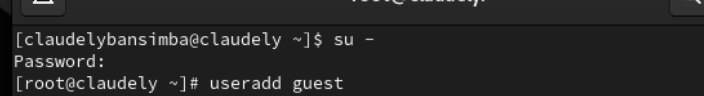{ #fig:001 width=70% height=70% }

2. Задайте пароль для пользователя guest (использую учётную запись администратора): passwd guest

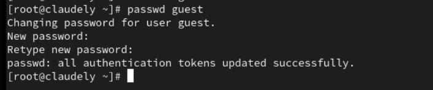{ #fig:002 width=70% height=70% }

3. Войдите в систему от имени пользователя guest.

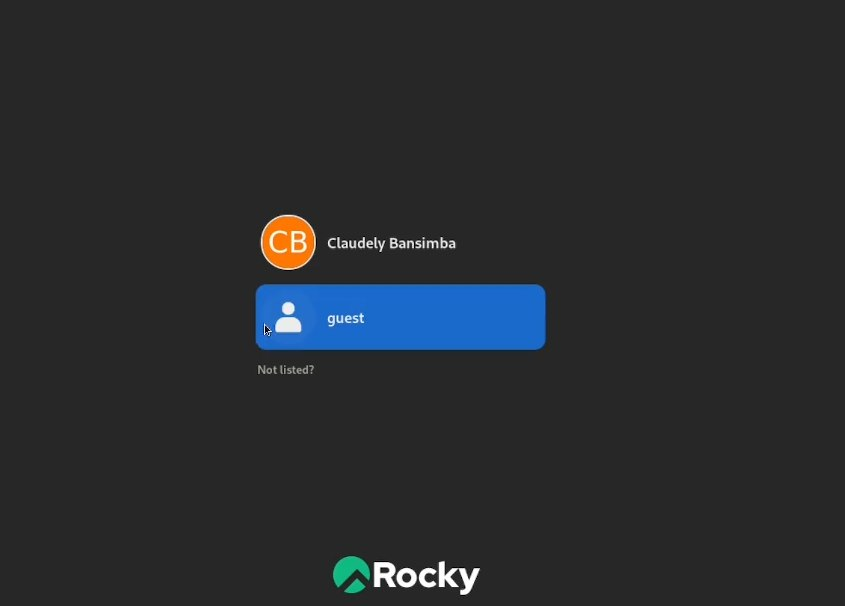{ #fig:003 width=70% height=70% }

4. Определите директорию, в которой вы находитесь, командой pwd. 

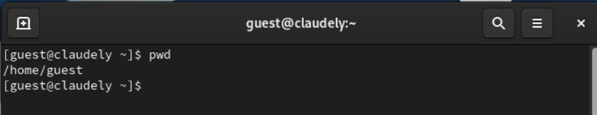{ #fig:004 width=70% height=70% }

5. Уточните имя вашего пользователя командой whoami.

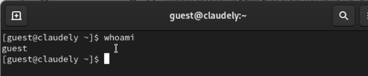{ #fig:005 width=70% height=70% }

6. Сравните вывод id с выводом команды groups.

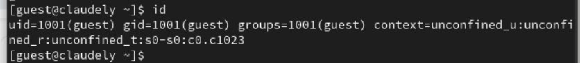{ #fig:006 width=70% height=70% }

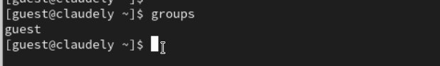{ #fig:007 width=70% height=70% }

7. Сравните полученную информацию об имени пользователя с данными,
выводимыми в приглашении командной строки.

8. Просмотрите файл /etc/passwd командой : cat /etc/passwd
{ #fig:008 width=70% height=70% }

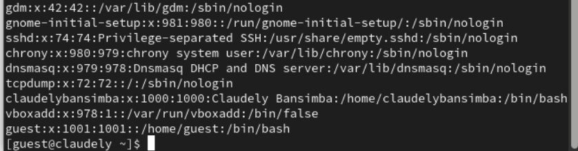{ #fig:009 width=70% height=70% }
 
 *cat /etc/passwd | grep guest
 
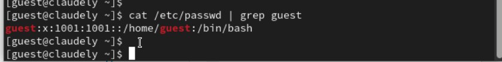{ #fig:010 width=70% height=70% }
 
 9. Определите существующие в системе директории командой : ls -l /home/
 
 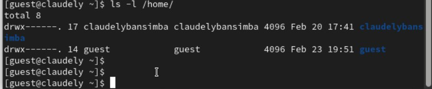{ #fig:011 width=70% height=70% }
 
 10. Проверьте, какие расширенные атрибуты установлены на поддиректо-
риях, находящихся в директории /home, командой: lsattr /home
 
 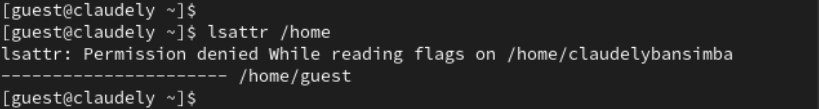{ #fig:012 width=70% height=70% }
 
 11. Создайте в домашней директории поддиректорию dir1 командой : mkdir dir1

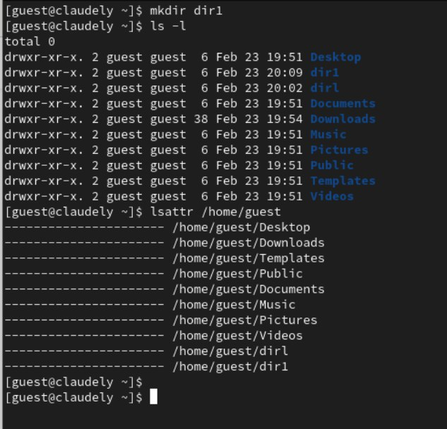{ #fig:013 width=70% height=70% }
 
 12. Снимите с директории dir1 все атрибуты командой : chmod 000 dir1
  
  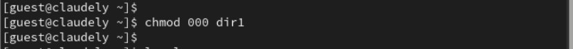{ #fig:014 width=70% height=70% }
 
и проверьте с её помощью правильность выполнения команды ls -l

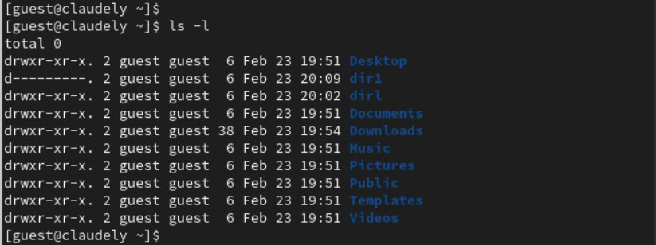{ #fig:015 width=70% height=70% }

13. Попытайтесь создать в директории dir1 файл file1 командой
echo "test" > /home/guest/dir1/file1

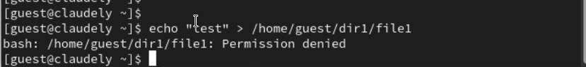{ #fig:016 width=70% height=70% }

Оцените, как сообщение об ошибке отразилось на создании файла? Проверьте командой ls -l /home/guest/dir1

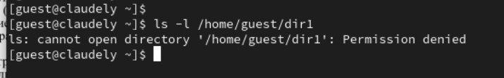{ #fig:017 width=70% height=70% }
 14. Заполните таблицу : 
 Замечание 1
 
 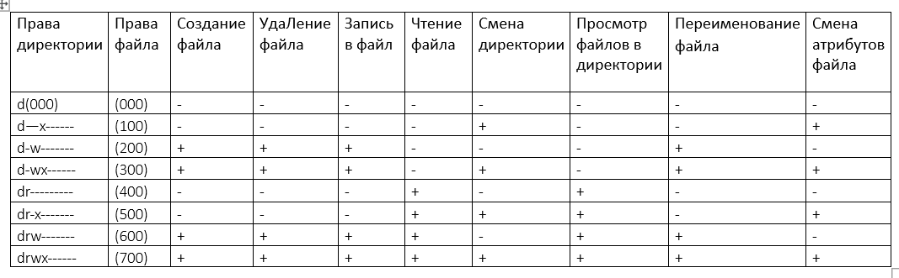{ #fig:018 width=70% height=70% }
 15. На основании заполненной таблицы определите те или иные минимально необходимые права для выполнения операций внутри директории dir1, заполните табл. 2.2.

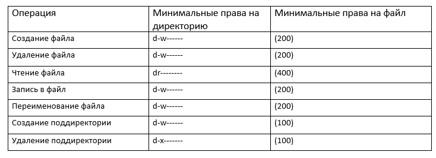{ #fig:019 width=70% height=70% }
 

# Выводы

в этой лаборатории мы узнали, как получить практические навыки работы с консолью с атрибутами файлов, закрепить теоретические основы дискреционного разграничения доступа в современных системах с открытым исходным кодом на базе Linux1.

