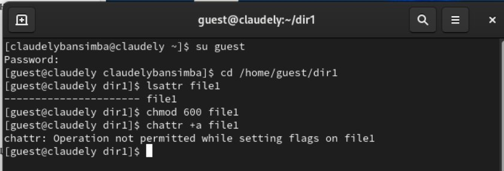
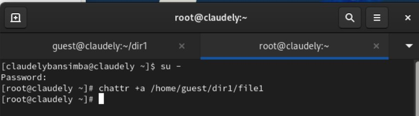
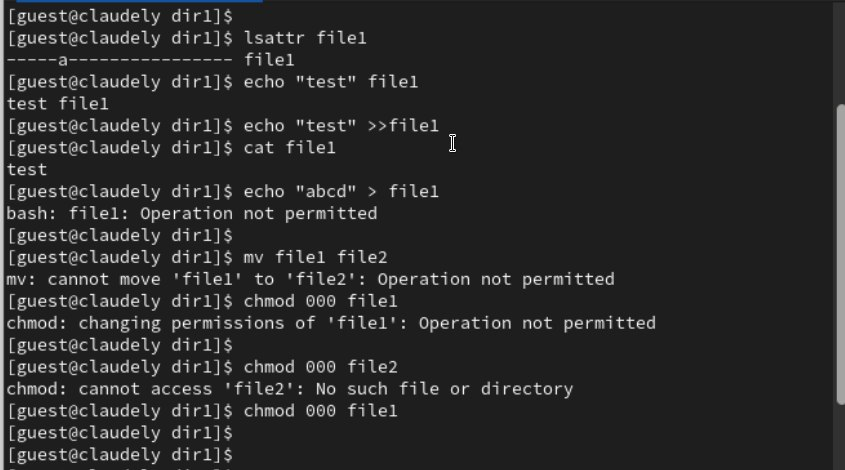
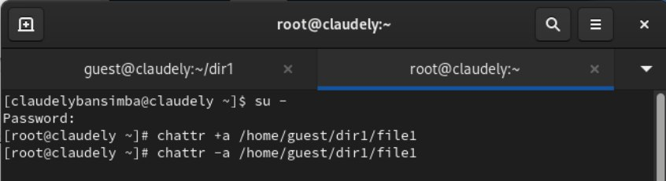
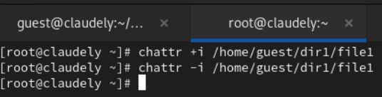
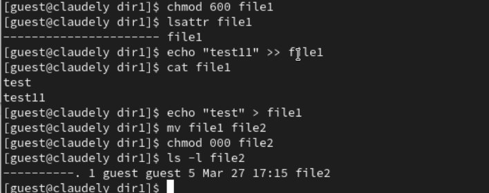

---
## Front matter
lang: ru-RU
title: Дискреционное разграничение прав в Linux. Расширенные атрибуты
author: |
	 Бансимба Клодели Дьегра  НПИбд-02-22\inst{1}

institute: |
	\inst{1}Российский Университет Дружбы Народов

date: 27 марта 2024, Москва, Россия

## Formatting
mainfont: PT Serif
romanfont: PT Serif
sansfont: PT Sans
monofont: PT Mono
toc: false
slide_level: 2
theme: metropolis
header-includes: 
 - \metroset{progressbar=frametitle,sectionpage=progressbar,numbering=fraction}
 - '\makeatletter'
 - '\beamer@ignorenonframefalse'
 - '\makeatother'
aspectratio: 169
section-titles: true

---
# Информация

:::::::::::::: {.columns align=center}
::: {.column width="70%"}

  * Бансимба Клодели Дьегра
  * Студент, НПИбд-02-22
  * Российский университет дружбы народов
  * [1032215651@pfur.ru](mailto: 1032215651@pfur.ru)

:::
::: {.column width="30%"}

:::
::::::::::::::

# Цели и задачи работы

## Цель лабораторной работы

Получение практических навыков работы в консоли с расширенными атрибутами файлов.

# Процесс выполнения лабораторной работы

## Pасширенные атрибуты файла
 От имени пользователя guest определите расширенные атрибуты файла /home/guest/dir1/file1
 
{ #fig:001 width=70% height=70% }

## Pасширенные атрибуты файла
Попробуйте установить расширенный атрибут a

{ #fig:002 width=70% height=70% }

## Проверка 
От пользователя guest проверьте правильность установления атрибута

{ #fig:003 width=70% height=70% }

## Cнимите расширенный атрибут a

{ #fig:004 width=70% height=70% }

##Заменив атрибут «a» атрибутом «i».

{ #fig:005 width=70% height=70% }

##Заменив атрибут «a» атрибутом «i».
В результате выполнения работы вы повысили свои навыки использования интерфейса командой строки (CLI),

{ #fig:006 width=70% height=70% }

# Выводы по проделанной работе

## Вывод

в этой лаборатории мы узнали, как получить практические навыки работы в консоли с расширенными
атрибутами файлов.

