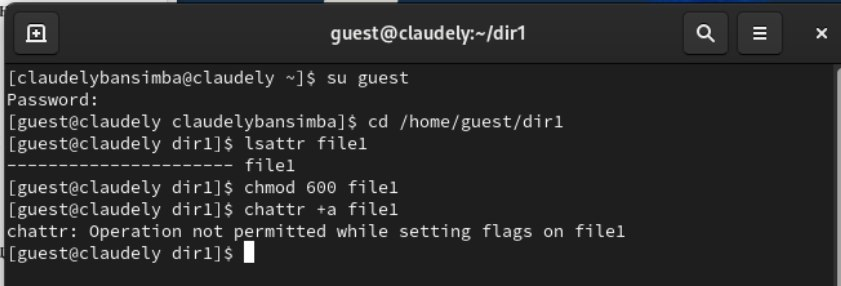
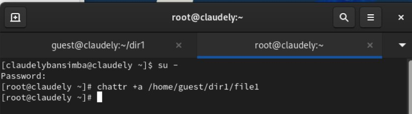
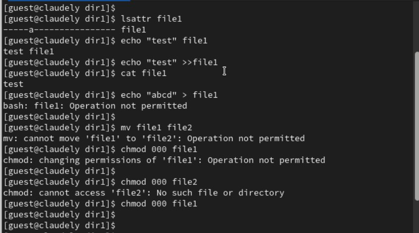
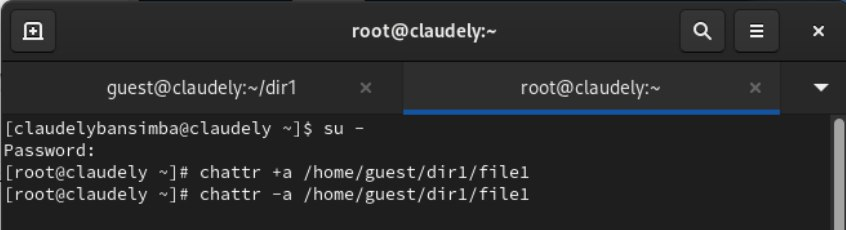
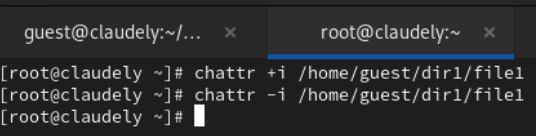
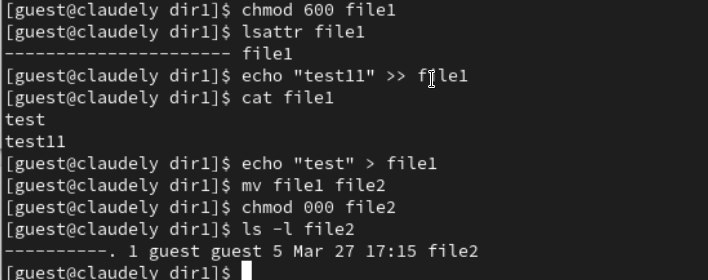

---
## Front matter
title: "Отчёт по лабораторной работе №04"
subtitle: "Дисциплина: Основы информационной безопасности"
author: "Бансимба Клодели Дьегра НПИбд-02-22 "

## Generic otions
lang: ru-RU
toc-title: "Содержание"

## Bibliography
bibliography: bib/cite.bib
csl: pandoc/csl/gost-r-7-0-5-2008-numeric.csl

## Pdf output format
toc: true # Table of contents
toc-depth: 2
lof: true # List of figures

fontsize: 12pt
linestretch: 1.5
papersize: a4
documentclass: scrreprt
## I18n polyglossia
polyglossia-lang:
  name: russian
  options:
	- spelling=modern
	- babelshorthands=true
polyglossia-otherlangs:
  name: english
## I18n babel
babel-lang: russian
babel-otherlangs: english
## Fonts
mainfont: PT Serif
romanfont: PT Serif
sansfont: PT Sans
monofont: PT Mono
mainfontoptions: Ligatures=TeX
romanfontoptions: Ligatures=TeX
sansfontoptions: Ligatures=TeX,Scale=MatchLowercase
monofontoptions: Scale=MatchLowercase,Scale=0.9
## Biblatex
biblatex: true
biblio-style: "gost-numeric"
biblatexoptions:
  - parentracker=true
  - backend=biber
  - hyperref=auto
  - language=auto
  - autolang=other*
  - citestyle=gost-numeric
## Pandoc-crossref LaTeX customization
figureTitle: "Рис."
tableTitle: "Таблица"
listingTitle: "Листинг"
lofTitle: "Список иллюстраций"
lolTitle: "Листинги"
## Misc options
indent: true
header-includes:
  - \usepackage{indentfirst}
  - \usepackage{float} # keep figures where there are in the text
  - \floatplacement{figure}{H} # keep figures where there are in the text
---

#  2.1 Цель работы

Получение практических навыков работы в консоли с расширенными
атрибутами файлов.

# 2.2 Порядок выполнения работы
1. От имени пользователя guest определите расширенные атрибуты файла /home/guest/dir1/file1 командой: lsattr /home/guest/dir1/file1. Установите командой chmod 600 file1 на файл file1 права, разрешающие чтение и запись для владельца файла. Попробуйте установить на файл /home/guest/dir1/file1 расширенный атрибут a от имени пользователя guest: chattr +a /home/guest/dir1/file1
В ответ вы должны получить отказ от выполнения операции.
 
{ #fig:001 width=70% height=70% }

2. Зайдите на третью консоль с правами администратора либо повысьте свои права с помощью команды su. Попробуйте установить расширенный атрибут a на файл /home/guest/dir1/file1 от имени суперпользователя:
chattr +a /home/guest/dir1/file1

{ #fig:002 width=70% height=70% }

3. От пользователя guest проверьте правильность установления атрибута: lsattr /home/guest/dir1/file1. Выполните дозапись в файл file1 слова «test» командой echo "test" /home/guest/dir1/file1. После этого выполните чтение файла file1 командой: cat /home/guest/dir1/file1. Убедитесь, что слово test было успешно записано в file1. 
Попробуйте удалить файл file1 либо стереть имеющуюся в нём информацию командой echo "abcd" > /home guest/dirl/file1. Попробуйте переименовать файл.
Попробуйте с помощью команды chmod 000 file1

{ #fig:003 width=70% height=70% }

4. Cнимите расширенный атрибут a с файла /home/guest/dirl/file1 отимени суперпользователя командой chattr -a /home/guest/dir1/file1

{ #fig:004 width=70% height=70% }

5. Повторите ваши действия по шагам, заменив атрибут «a» атрибутом «i».

{ #fig:005 width=70% height=70% }

В результате выполнения работы вы повысили свои навыки использования интерфейса командой строки (CLI),

{ #fig:006 width=70% height=70% }

# Выводы

в этой лаборатории мы узнали, как получить практические навыки работы в консоли с расширенными
атрибутами файлов.

