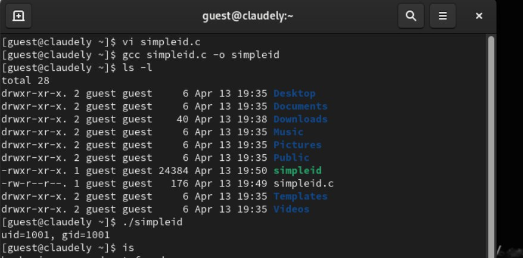
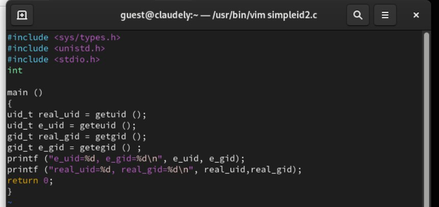
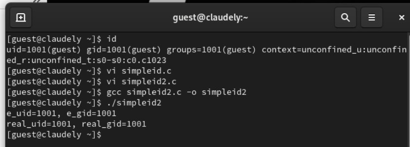
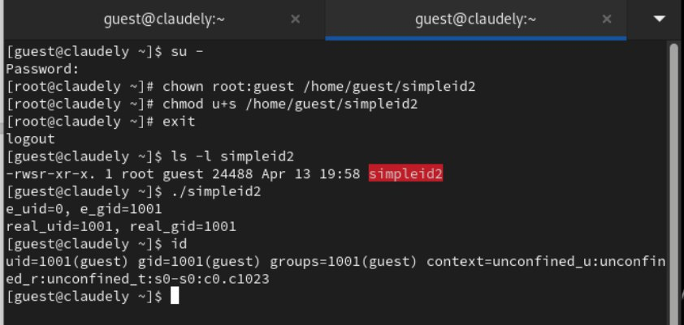
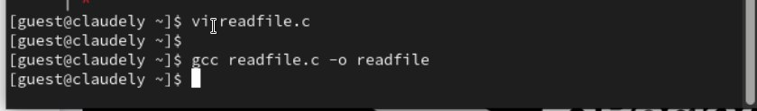
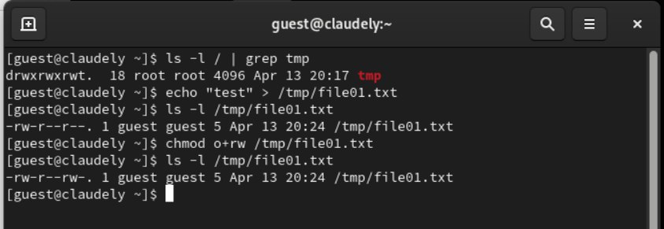
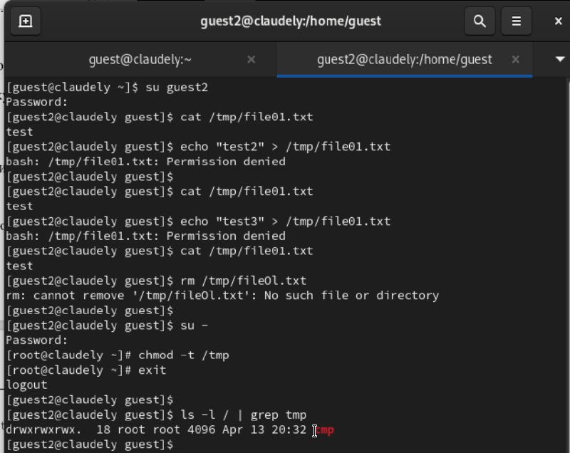

---
## Front matter
lang: ru-RU
title: Дискреционное разграничение прав в Linux. Расширенные атрибуты
author: |
	 Бансимба Клодели Дьегра  НПИбд-02-22\inst{1}

institute: |
	\inst{1}Российский Университет Дружбы Народов

date: 13 апреля 2024, Москва, Россия

## Formatting
mainfont: PT Serif
romanfont: PT Serif
sansfont: PT Sans
monofont: PT Mono
toc: false
slide_level: 2
theme: metropolis
header-includes: 
 - \metroset{progressbar=frametitle,sectionpage=progressbar,numbering=fraction}
 - '\makeatletter'
 - '\beamer@ignorenonframefalse'
 - '\makeatother'
aspectratio: 169
section-titles: true

---
# Информация

:::::::::::::: {.columns align=center}
::: {.column width="70%"}

  * Бансимба Клодели Дьегра
  * Студент, НПИбд-02-22
  * Российский университет дружбы народов
  * [1032215651@pfur.ru](mailto: 1032215651@pfur.ru)

:::
::: {.column width="30%"}

:::
::::::::::::::

# Цели и задачи работы

## Цель лабораторной работы

Изучение механизмов изменения идентификаторов, применения SetUID- и Sticky-битов. Получение практических навыков работы в консоли с дополнительными атрибутами. Рассмотрение работы механизма смены идентификатора процессов пользователей, а также влияние бита Sticky на запись и удаление файлов

# Процесс выполнения лабораторной работы

## Создание программы
Написали программу simpleid.c.Скомпилировали программу и убедилисьe1
 
{ #fig:002 width=70% height=70%}

## Создание программы
Усложнили программу, добавив вывод действительных идентификаторов.

{ #fig:003 width=70% height=70%}

## Создание программы
Скомпилировали и запустили simpleid2.c: 

{ #fig:004 width=70% height=70%}

## Создание программы
Запустили simpleid2 и id:

{ #fig:005 width=70% height=70%}

## Создание программы
Откомпилировали её.

{ #fig:007 width=70% height=70%}

## Исследование Sticky-бита

Просмотрели атрибуты у только что созданного файла и разрешили чтение и запись для категории пользователей «все остальные»:

{ #fig:009 width=70% height=70%}

## Исследование Sticky-бита
От пользователя  проверили, что атрибута t у директории /tmp нет:

{ #fig:010 width=70% height=70%}

# Выводы по проделанной работе

## Вывод

Изучили механизмы изменения идентификаторов, применения SetUID- и Sticky-битов. Получили практические навыки работы в консоли с дополнительными атрибутами.

