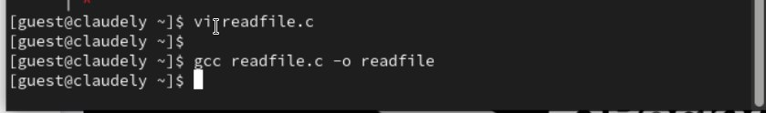

---
## Front matter
title: "Отчёт по лабораторной работе №05"
subtitle: "Дисциплина: Основы информационной безопасности"
author: "Бансимба Клодели Дьегра НПИбд-02-22 "

## Generic otions
lang: ru-RU
toc-title: "Содержание"

## Bibliography
bibliography: bib/cite.bib
csl: pandoc/csl/gost-r-7-0-5-2008-numeric.csl

## Pdf output format
toc: true # Table of contents
toc-depth: 2
lof: true # List of figures

fontsize: 12pt
linestretch: 1.5
papersize: a4
documentclass: scrreprt
## I18n polyglossia
polyglossia-lang:
  name: russian
  options:
	- spelling=modern
	- babelshorthands=true
polyglossia-otherlangs:
  name: english
## I18n babel
babel-lang: russian
babel-otherlangs: english
## Fonts
mainfont: PT Serif
romanfont: PT Serif
sansfont: PT Sans
monofont: PT Mono
mainfontoptions: Ligatures=TeX
romanfontoptions: Ligatures=TeX
sansfontoptions: Ligatures=TeX,Scale=MatchLowercase
monofontoptions: Scale=MatchLowercase,Scale=0.9
## Biblatex
biblatex: true
biblio-style: "gost-numeric"
biblatexoptions:
  - parentracker=true
  - backend=biber
  - hyperref=auto
  - language=auto
  - autolang=other*
  - citestyle=gost-numeric
## Pandoc-crossref LaTeX customization
figureTitle: "Рис."
tableTitle: "Таблица"
listingTitle: "Листинг"
lofTitle: "Список иллюстраций"
lolTitle: "Листинги"
## Misc options
indent: true
header-includes:
  - \usepackage{indentfirst}
  - \usepackage{float} # keep figures where there are in the text
  - \floatplacement{figure}{H} # keep figures where there are in the text
---

#  5.1 Цель работы

Изучение механизмов изменения идентификаторов, применения SetUID- и Sticky-битов. Получение практических навыков работы в консоли с дополнительными атрибутами. Рассмотрение работы механизма смены идентификатора процессов пользователей, а также влияние бита Sticky на запись и удаление файлов

# 5.2 Порядок выполнения работы
## 5.2.1 Создание программы

1.	Вошли в систему от имени пользователя guest.

{ #fig:001 width=70% height=70%}

2.	Написали программу simpleid.c.Скомпилировали программу и убедились, что файл программы создан: gcc simpleid.c -o simpleid. Выполнили программу simpleid командой ./simpleid. Выполнили системную программу id с помощью команды id. uid и gid совпадает в обеих программах

{ #fig:002 width=70% height=70%}

3.	Усложнили программу, добавив вывод действительных идентификаторов.

{ #fig:003 width=70% height=70%}

4.	Скомпилировали и запустили simpleid2.c: 

{ #fig:004 width=70% height=70%}

5.	От имени суперпользователя выполнили команды, Использовали su для повышения прав до суперпользователя.Выполнили проверку правильности установки новых атрибутов и смены владельца файла simpleid2:
Запустили simpleid2 и id:

{ #fig:005 width=70% height=70%}

6.	Проделали тоже самое относительно SetGID-бита.Написали программу readfile.c

{ #fig:006 width=70% height=70%}


7. Откомпилировали её.

```
gcc readfile.c -o readfile
```
{ #fig:007 width=70% height=70%}

8. Сменили владельца у файла readfile.c и изменили права так, чтобы только суперпользователь (root) мог прочитать его, a guest не мог.Проверили, что пользователь guest не может прочитать файл readfile.c .Сменили у программы readfile владельца и установили SetU’D-бит.Проверили, может ли программа readfile прочитать файл readfile.c Проверили, может ли программа readfile прочитать файл /etc/shadow

{ #fig:008 width=70% height=70%}


##Исследование Sticky-бита
1.	Выяснили, установлен ли атрибут Sticky на директории /tmp:

```
ls -l / | grep tmp
```

2.	От имени пользователя guest создали файл file01.txt в директории /tmp со словом test:

```
echo "test" > /tmp/file01.txt
```

3.	Просмотрели атрибуты у только что созданного файла и разрешили чтение и запись для категории пользователей «все остальные»:

```
ls -l /tmp/file01.txt
chmod o+rw /tmp/file01.txt
ls -l /tmp/file01.txt
```

{ #fig:009 width=70% height=70%}


4.	От пользователя (не являющегося владельцем) попробовали прочитать файл /file01.txt:

```
cat /file01.txt

```

5.	От пользователя попробовали дозаписать в файл /file01.txt слово test3 командой:

```
echo "test2" >> /file01.txt
```

6.	Проверили содержимое файла командой:

```
cat /file01.txt
```

В файле теперь записано:
```
Test
Test2

```

7.	От пользователя попробовали записать в файл /tmp/file01.txt слово test4, стерев при этом всю имеющуюся в файле информацию командой. Для этого воспользовалась командой echo "test3" > /tmp/file01.txt

8.	Проверили содержимое файла командой

```

cat /tmp/file01.txt

```

9.	От пользователя попробовали удалить файл /tmp/file01.txt командой rm /tmp/file01.txt, однако получила отказ.

10.	От суперпользователя командой выполнили команду, снимающую атрибут t (Sticky-бит) с директории /tmp:

```

chmod -t /tmp

```

Покинули режим суперпользователя командой exit.

11.	От пользователя  проверили, что атрибута t у директории /tmp нет:

```

ls -l / | grep tmp

```
{ #fig:010 width=70% height=70%}


12.	Повторили предыдущие шаги. Получилось удалить файл

13.	Удалось удалить файл от имени пользователя, не являющегося его владельцем.

14.	Повысили свои права до суперпользователя и вернули атрибут t на директорию /tmp :

```

su

chmod +t /tmp

exit

```

{ #fig:011 width=70% height=70%}


# Выводы

Изучили механизмы изменения идентификаторов, применения SetUID- и Sticky-битов. Получили практические навыки работы в консоли с дополнительными атрибутами.


