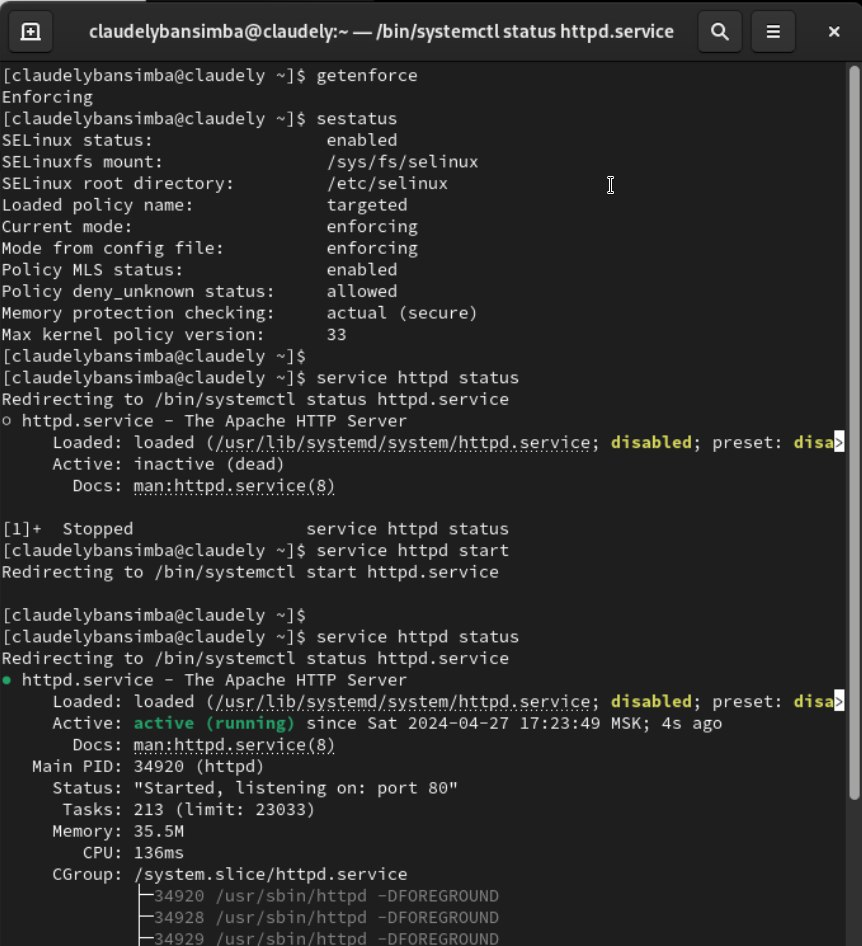
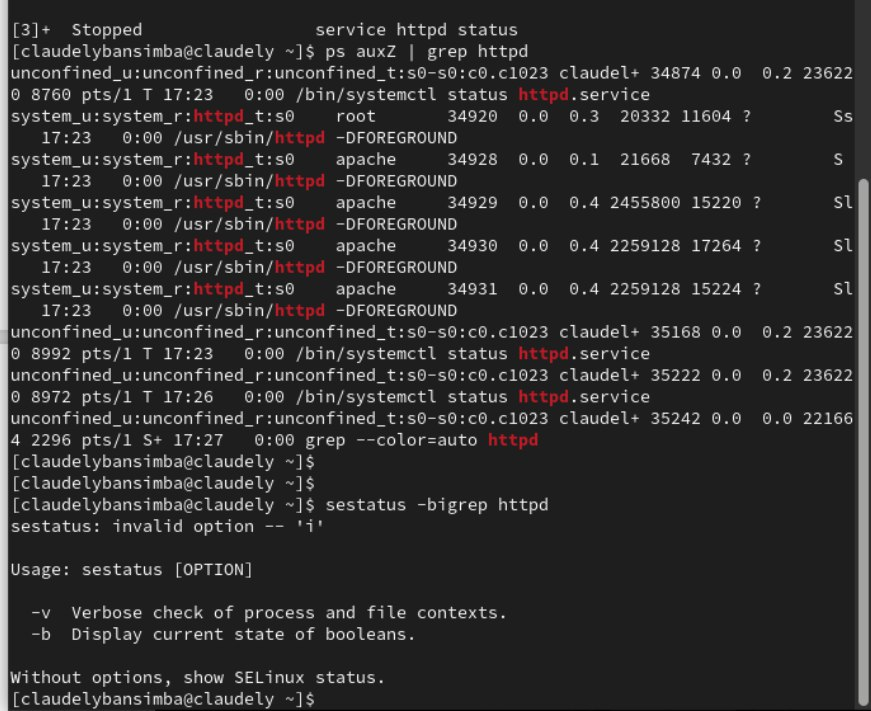
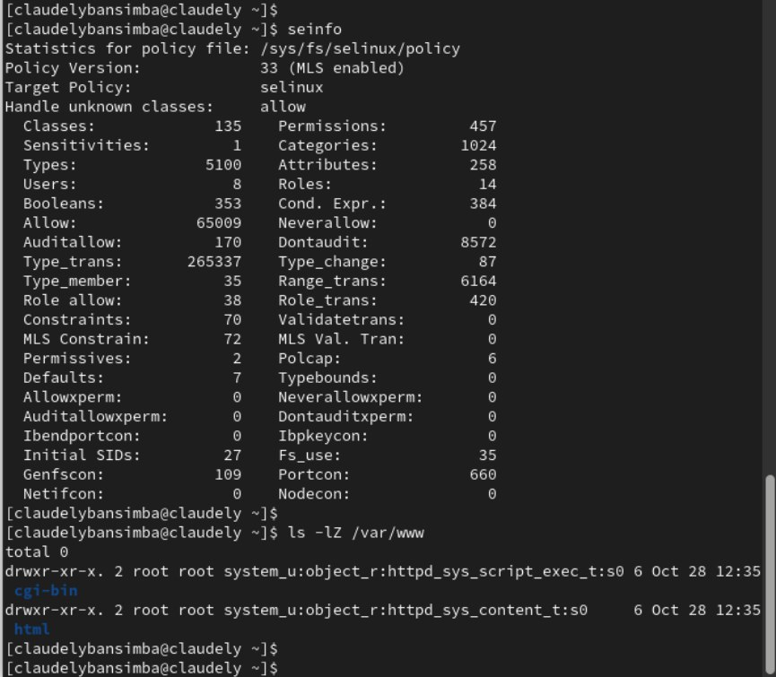
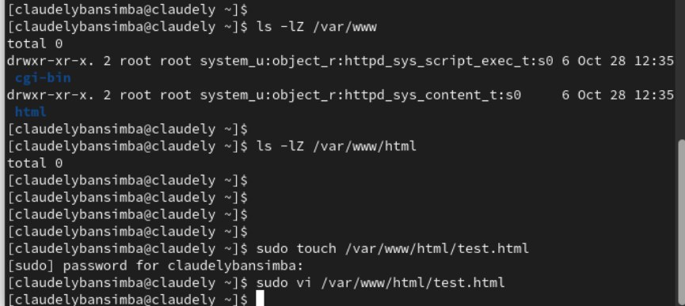
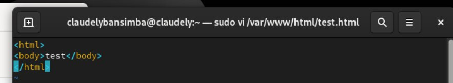
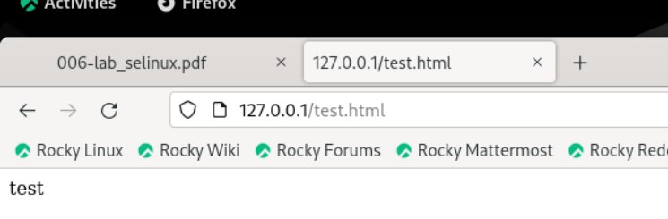
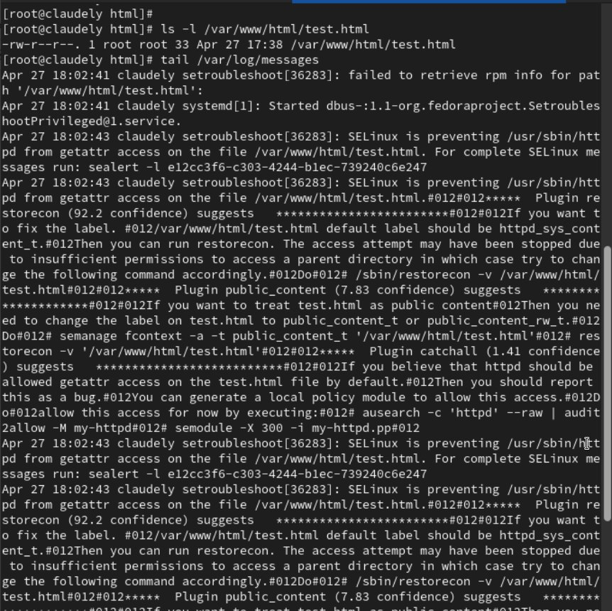
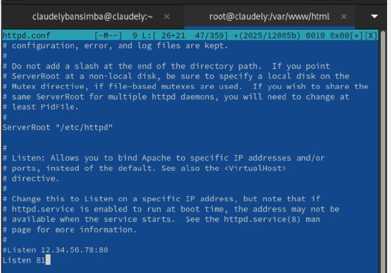
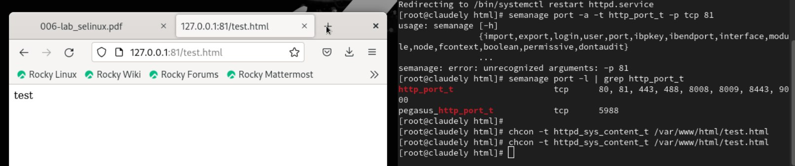

---
## Front matter
lang: ru-RU
title: Мандатное разграничение прав в Linux
author: |
	 Бансимба Клодели Дьегра  НПИбд-02-22\inst{1}

institute: |
	\inst{1}Российский Университет Дружбы Народов

date: 27 апреля 2024, Москва, Россия

## Formatting
mainfont: PT Serif
romanfont: PT Serif
sansfont: PT Sans
monofont: PT Mono
toc: false
slide_level: 2
theme: metropolis
header-includes: 
 - \metroset{progressbar=frametitle,sectionpage=progressbar,numbering=fraction}
 - '\makeatletter'
 - '\beamer@ignorenonframefalse'
 - '\makeatother'
aspectratio: 169
section-titles: true

---
# Информация

:::::::::::::: {.columns align=center}
::: {.column width="70%"}

  * Бансимба Клодели Дьегра
  * Студент, НПИбд-02-22
  * Российский университет дружбы народов
  * [1032215651@pfur.ru](mailto: 1032215651@pfur.ru)

:::
::: {.column width="30%"}

:::
::::::::::::::

# Цели и задачи работы

## Цель лабораторной работы

Развить навыки администрирования ОС Linux. Получить первое практическое знакомство с технологией SELinux. Проверить работу SELinx на практике совместно с веб-сервером Apache.

# Процесс выполнения лабораторной работы

## Запуск http
Войдите в систему с полученными учётными данными и убедитесь, что SELinux работает в режиме enforcing
 
{ #fig:001 width=70% height=70%}

## переключатели SELinux для http

Посмотрили текущее состояние переключателей SELinux для Apache

{ #fig:002 width=70% height=70%}

## переключатели SELinux для http
Посмотрили статистику по политике с помощью команды seinfoю

{ #fig:003 width=70% height=70%}

## создание html-файла и доступ по http
создание html-файла и доступ по http

{ #fig:004 width=70% height=70%}

## создание html-файла и доступ по http
{ #fig:005 width=70% height=70%}

## успешно отображён
успешно отображён

{ #fig:006 width=70% height=70%}

## успешно отображён
Просмотрите log-файлы веб-сервера Apache.

{ #fig:009 width=70% height=70%}

## переключение порта
Для этого в файле /etc/httpd/httpd.conf найдите строчку Listen 80 и замените её на Listen 81.

{ #fig:010 width=70% height=70%}

## переключение порта
попробуйте получить доступ к файлу через веб-сервер, введя в браузере адрес http://127.0.0.1:81/test

{ #fig:011 width=70% height=70%}

# Выводы по проделанной работе

## Вывод

В процессе выполнения лабораторной работы мною были получены базовые навыки работы с технологией seLinux.

