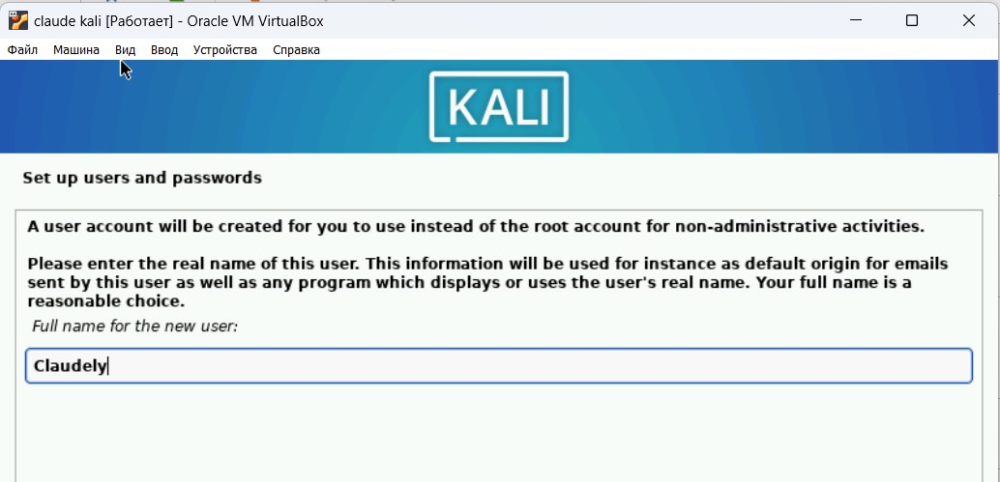

---
## Front matter
lang: ru-RU
title: Отчёт по индивидуальному проекту. Этап 1
author: |
	 Бансимба Клодели Дьегра  НПИбд-02-22\inst{1}

institute: |
	\inst{1}Российский Университет Дружбы Народов

date: 01 марта, Москва, Россия

## Formatting
mainfont: PT Serif
romanfont: PT Serif
sansfont: PT Sans
monofont: PT Mono
toc: false
slide_level: 2
theme: metropolis
header-includes: 
 - \metroset{progressbar=frametitle,sectionpage=progressbar,numbering=fraction}
 - '\makeatletter'
 - '\beamer@ignorenonframefalse'
 - '\makeatother'
aspectratio: 169
section-titles: true

---
# Информация

:::::::::::::: {.columns align=center}
::: {.column width="70%"}

  * Бансимба Клодели Дьегра
  * Студент, НПИбд-02-22
  * Российский университет дружбы народов
  * [1032215651@pfur.ru](mailto: 1032215651@pfur.ru)

:::
::: {.column width="30%"}

:::
::::::::::::::

# Цели и задачи работы

## Цель лабораторной работы

Установка дистрибутивa Kali Linux в виртуальную машину.

# Процесс выполнения лабораторной работы

## Создаю виртуальную машину
 Создали виртуальную машину, указали имя машины, ее расположение и добавили ISO образ
 
{ #fig:001 width=70% height=70% }

## Создаю виртуальную машину
Указали размер оперативной памяти.

{#fig:002 width=70%}

## Создаю виртуальную машину
Создали виртуальный жесткий диск и выделили память в размере 40 Гб.

{#fig:003 width=70%}

## Создание пользователя

создаем пользователя  и вводим пароль .

{ #fig:004 width=70% height=70% }

## Создание пользователя
Пароль.

{ #fig:005 width=70% height=70% }

## Рабочая система
давайте запустим виртуальную машину

{ #fig:006 width=70% height=70% }

## Информация о пользователе
Информация о пользователе

{ #fig:007 width=70% height=70% }

# Выводы по проделанной работе

## Вывод

В ходе выполнения данной лабораторной работыб, я установил дистрибутив Kali Linux на мою виртуальную машину.

