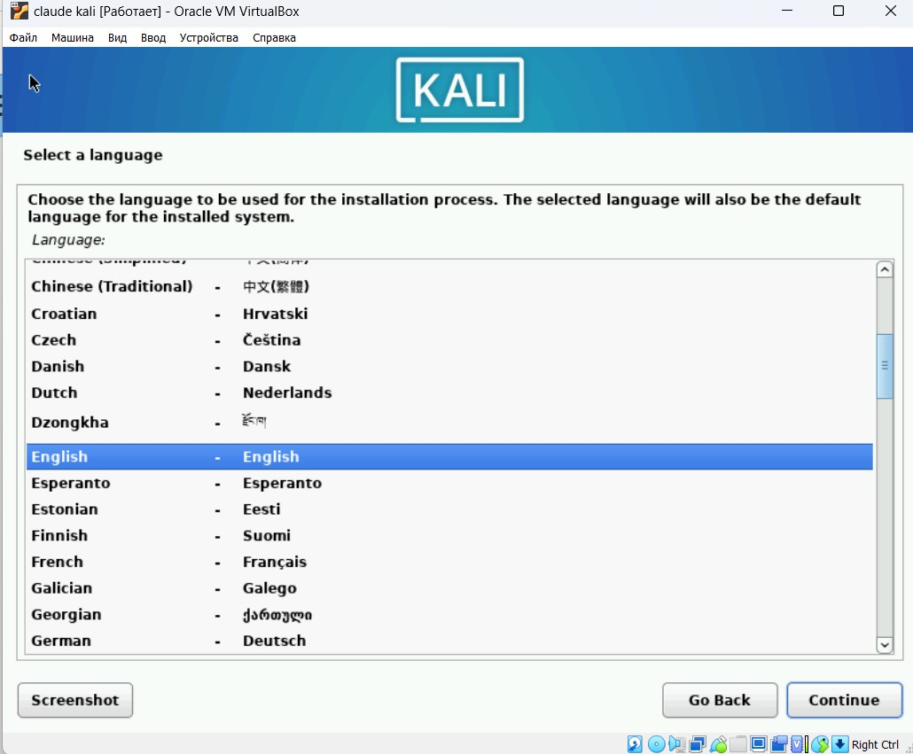
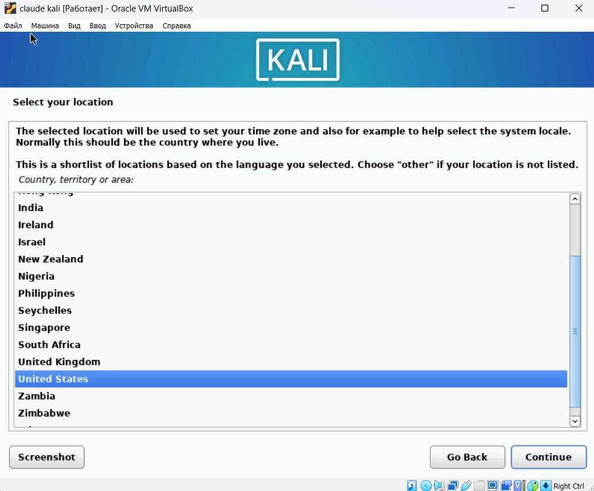

---
## Front matter
title: "Отчёт по индивидуальному проекту. Этап 1" 
subtitle: "Дисциплина: Основы информационной безопасности"
author: "Бансимба Клодели Дьегра НПИбд-02-22 "

## Generic otions
lang: ru-RU
toc-title: "Содержание"

## Bibliography
bibliography: bib/cite.bib
csl: pandoc/csl/gost-r-7-0-5-2008-numeric.csl

## Pdf output format
toc: true # Table of contents
toc-depth: 2
lof: true # List of figures
lot: true # List of tables
fontsize: 12pt
linestretch: 1.5
papersize: a4
documentclass: scrreprt
## I18n polyglossia
polyglossia-lang:
  name: russian
  options:
	- spelling=modern
	- babelshorthands=true
polyglossia-otherlangs:
  name: english
## I18n babel
babel-lang: russian
babel-otherlangs: english
## Fonts
mainfont: PT Serif
romanfont: PT Serif
sansfont: PT Sans
monofont: PT Mono
mainfontoptions: Ligatures=TeX
romanfontoptions: Ligatures=TeX
sansfontoptions: Ligatures=TeX,Scale=MatchLowercase
monofontoptions: Scale=MatchLowercase,Scale=0.9
## Biblatex
biblatex: true
biblio-style: "gost-numeric"
biblatexoptions:
  - parentracker=true
  - backend=biber
  - hyperref=auto
  - language=auto
  - autolang=other*
  - citestyle=gost-numeric
## Pandoc-crossref LaTeX customization
figureTitle: "Рис."
tableTitle: "Таблица"
listingTitle: "Листинг"
lofTitle: "Список иллюстраций"
lotTitle: "Список таблиц"
lolTitle: "Листинги"
## Misc options
indent: true
header-includes:
  - \usepackage{indentfirst}
  - \usepackage{float} # keep figures where there are in the text
  - \floatplacement{figure}{H} # keep figures where there are in the text
---

# Цель работы

Установка дистрибутивa Kali Linux в виртуальную машину.

# Выполнение лабораторной работы

Скачали ISO образ с официального сайта Kali Linux : https://www.kali.org/. Создали виртуальную машину, указали имя машины, ее расположение и добавили ISO образ.

{#fig:001 width=70%}

Указали размер оперативной памяти. 

{#fig:002 width=70%}

Создали виртуальный жесткий диск и выделили память в размере 40 Гб.

{#fig:003 width=70%}

Устанавливли язык для интерфейса и раскладки клавиатуры

{#fig:004 width=70%}

{#fig:005 width=70%}

создаем пользователя (рис. [-@fig:006]) и вводим пароль (рис. [-@fig:008]).

{#fig:006 width=70%}

{#fig:007 width=70%}

Подключение образа диска дополнений гостевой ОС

{ #fig:008 width=70% height=70% }

{ #fig:009 width=70% height=70% }

После установки перезапустили виртуальную машину. Открыли терминал и проверили его работу .

{ #fig:010 width=70% height=70% }

# Выводы

В ходе выполнения данной лабораторной работыб, я установил дистрибутив Kali Linux на мою виртуальную машину.

# Список литературы{.unnumbered}

1. Парасрам, Ш. Kali Linux: Тестирование на проникновение и безопасность : Для профессионалов. Kali Linux / Ш. Парасрам, А. Замм, Т. Хериянто, и др. – Санкт-Петербург : Питер, 2022. – 448 сс.
