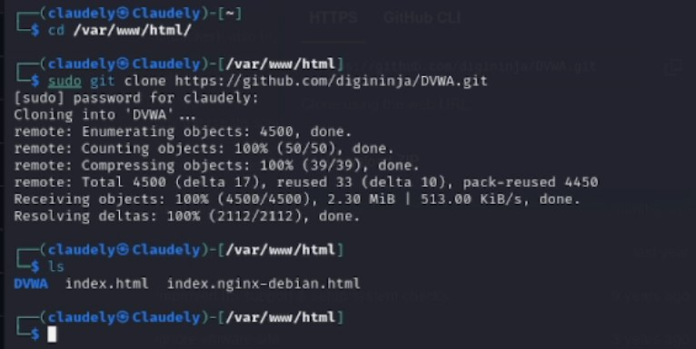
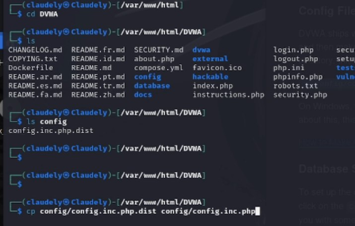
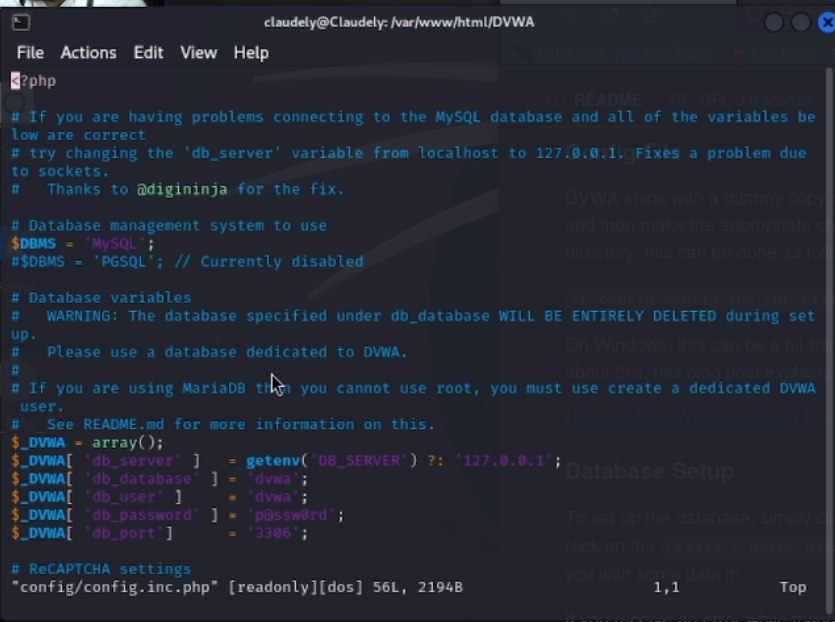
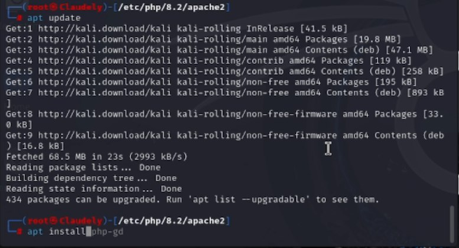
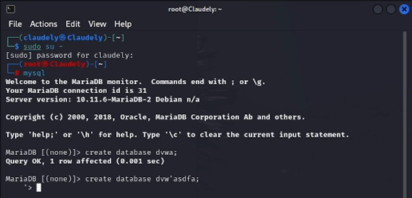
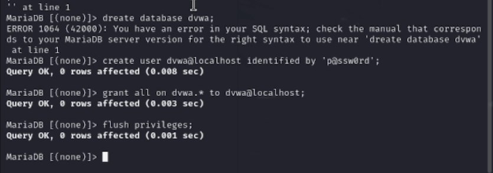
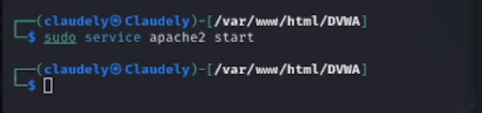
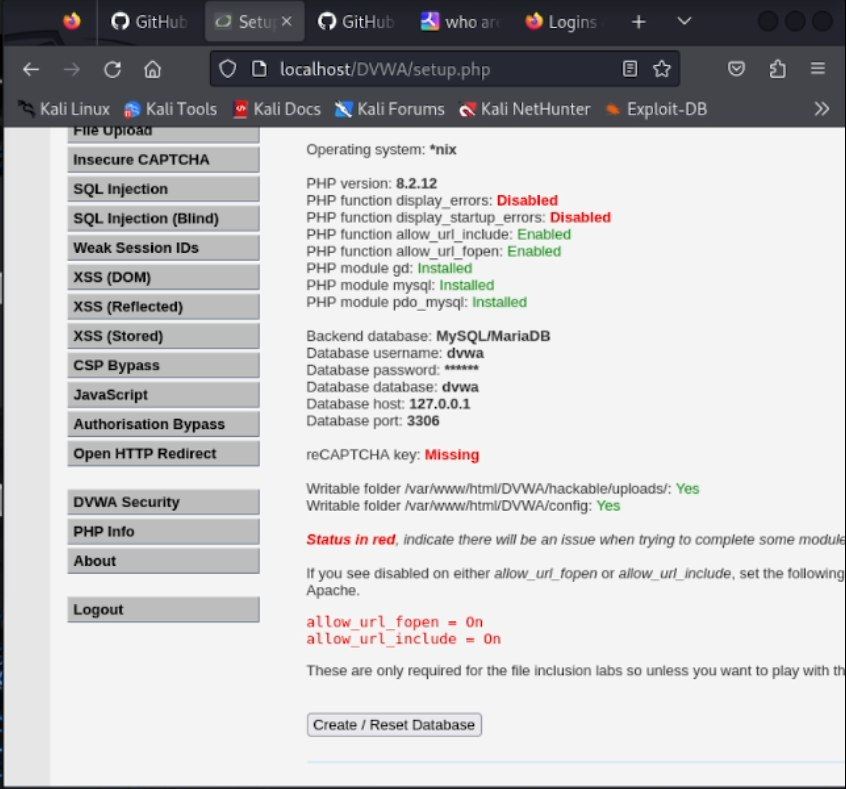
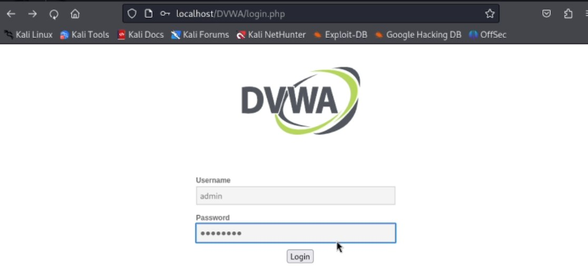
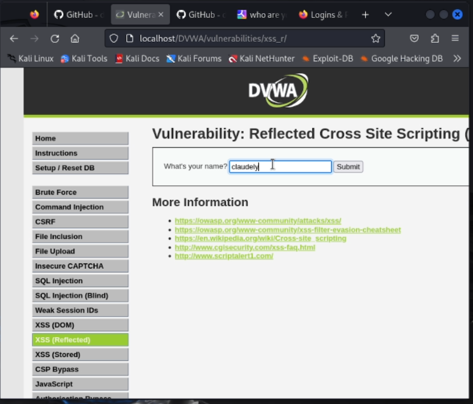

---
## Front matter
title: "Отчёт по индивидуальному проекту. Этап 2" 
subtitle: "Дисциплина: Основы информационной безопасности"
author: "Бансимба Клодели Дьегра НПИбд-02-22 "

## Generic otions
lang: ru-RU
toc-title: "Содержание"

## Bibliography
bibliography: bib/cite.bib
csl: pandoc/csl/gost-r-7-0-5-2008-numeric.csl

## Pdf output format
toc: true # Table of contents
toc-depth: 2
lof: true # List of figures
lot: true # List of tables
fontsize: 12pt
linestretch: 1.5
papersize: a4
documentclass: scrreprt
## I18n polyglossia
polyglossia-lang:
  name: russian
  options:
	- spelling=modern
	- babelshorthands=true
polyglossia-otherlangs:
  name: english
## I18n babel
babel-lang: russian
babel-otherlangs: english
## Fonts
mainfont: PT Serif
romanfont: PT Serif
sansfont: PT Sans
monofont: PT Mono
mainfontoptions: Ligatures=TeX
romanfontoptions: Ligatures=TeX
sansfontoptions: Ligatures=TeX,Scale=MatchLowercase
monofontoptions: Scale=MatchLowercase,Scale=0.9
## Biblatex
biblatex: true
biblio-style: "gost-numeric"
biblatexoptions:
  - parentracker=true
  - backend=biber
  - hyperref=auto
  - language=auto
  - autolang=other*
  - citestyle=gost-numeric
## Pandoc-crossref LaTeX customization
figureTitle: "Рис."
tableTitle: "Таблица"
listingTitle: "Листинг"
lofTitle: "Список иллюстраций"
lotTitle: "Список таблиц"
lolTitle: "Листинги"
## Misc options
indent: true
header-includes:
  - \usepackage{indentfirst}
  - \usepackage{float} # keep figures where there are in the text
  - \floatplacement{figure}{H} # keep figures where there are in the text
---

# Цель работы

Установка DVWA в гостевой системе Kali Linux.

# Выполнение лабораторной работы

Перейдем в каталог html: cd /var/www/html Клонируем репозиторий git: sudo git clone https://github.com/digininja/DVWA.git. Перейдем к файлу конфигурации в каталоге установки (рис. [-@fig:001]): cd DVWA. затем давайте проверим список на наличие содержимого каталога

{#fig:001 width=/70%}

Скопируем файл конфигурации и переименуем его: cp config.inc.php.dist config.inc.php (рис. [-@fig:002]). 

{#fig:002 width=70%}

Откроем файл настроек vim  config/config.inc.php (рис. [-@fig:003]).

{#fig:003 width=70%}

Установим mariadb (рис. [-@fig:004]).

{#fig:004 width=70%}

Запустим базу данных: sudo su-, затем mysql (рис. [-@fig:005]).

{#fig:005 width=70%}

создадим нового пользователя базы данных. Для этого давайте подключимся к базе данных как пользователь root, а затем воспользуемся следующими командами:(рис. [-@fig:006]).

{#fig:006 width=70%}

Запустиv сервер Apache (рис. [-@fig:007]): sudo service apache2 start

{#fig:007 width=70%}

Открываем DVWA в браузере: localhost/DVWA/setup.php (рис. [-@fig:008]).

{#fig:008 width=70%}

Давайте нажмем Create / Reset Database. Давайте нажмем create, чтобы создать базу данных. Затем введите имя пользователя и пароль

{#fig:009 width=70%}

{#fig:010 width=70%}

# Выводы

В ходе выполнения данной лабораторной работыб, я установил DVWA в гостевой системе Kali Linux.

# Список литературы{.unnumbered}

1. Парасрам, Ш. Kali Linux: Тестирование на проникновение и безопасность : Для профессионалов. Kali Linux / Ш. Парасрам, А. Замм, Т. Хериянто, и др. – Санкт-Петербург : Питер, 2022. – 448 сс.
