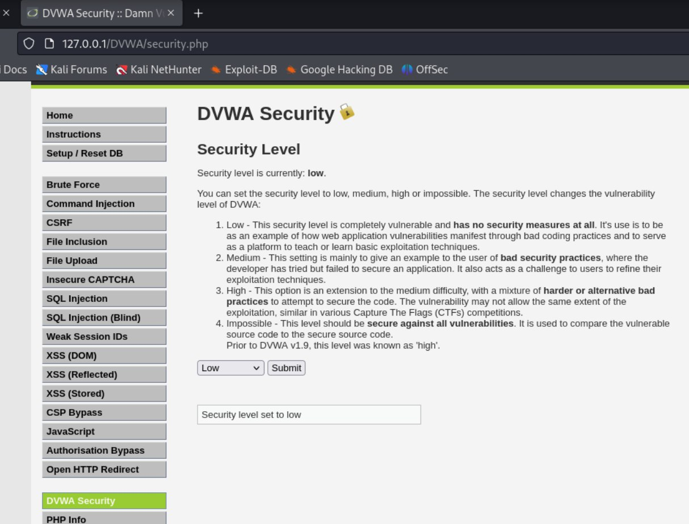
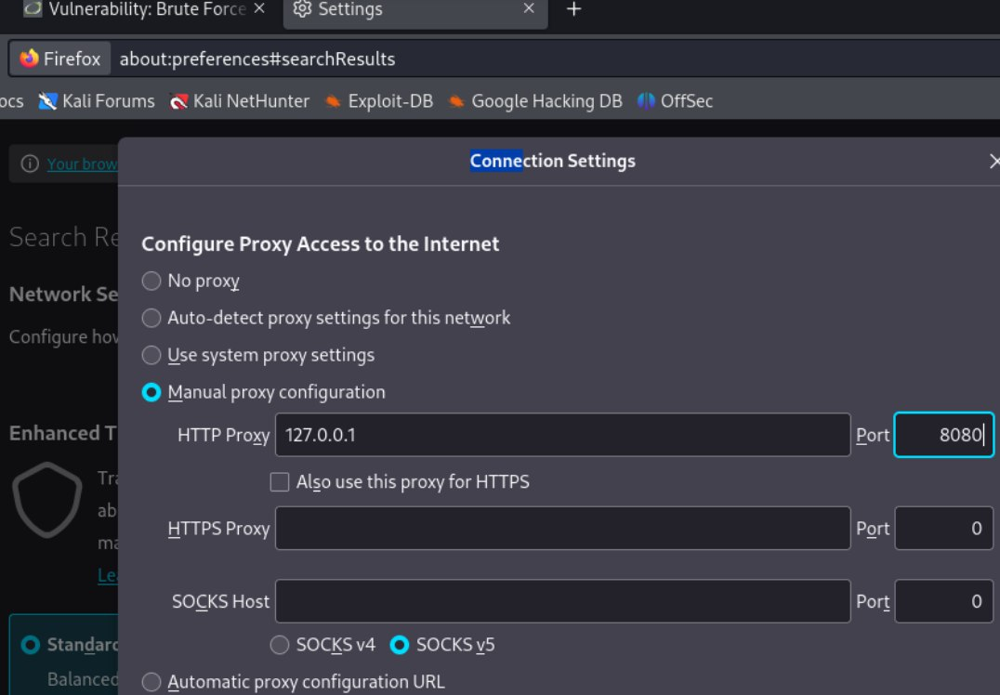
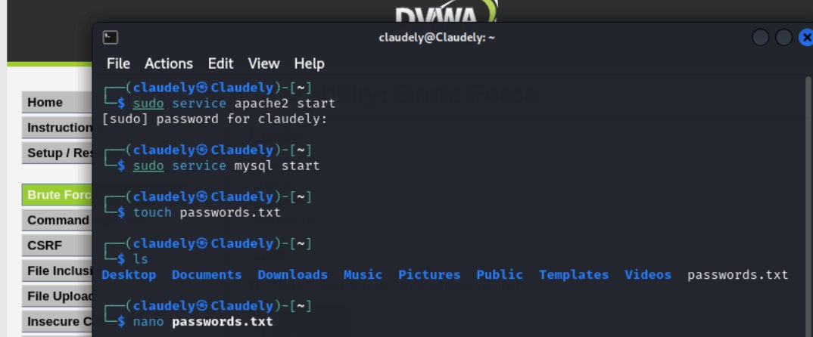
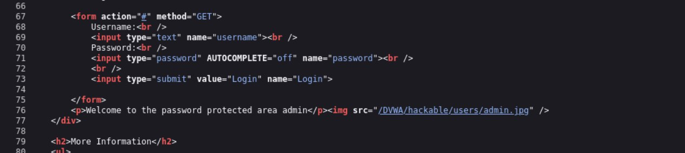
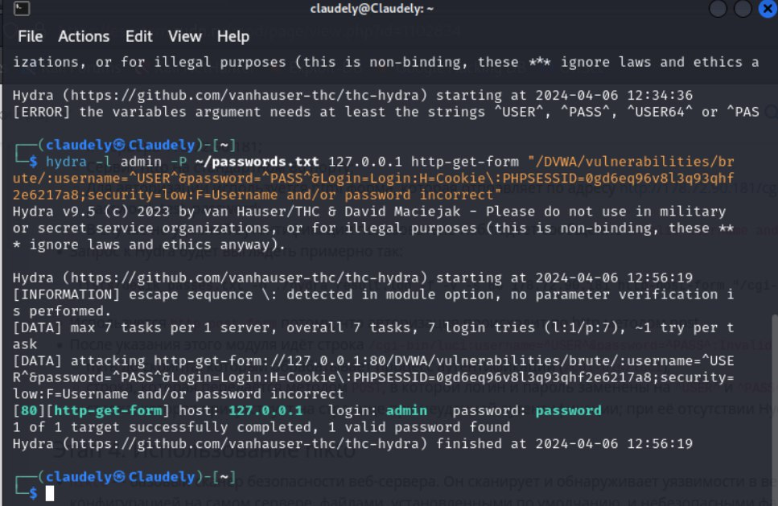
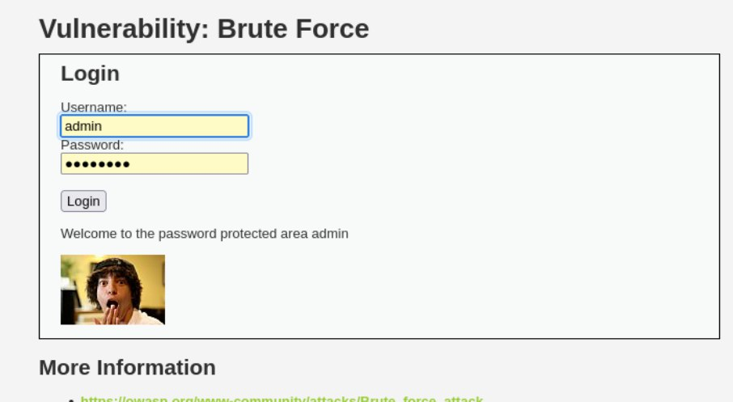

---
## Front matter
lang: ru-RU
title: Отчёт по индивидуальному проекту. Этап 3
author: |
	 Бансимба Клодели Дьегра  НПИбд-02-22\inst{1}

institute: |
	\inst{1}Российский Университет Дружбы Народов

date: 16 марта, Москва, Россия

## Formatting
mainfont: PT Serif
romanfont: PT Serif
sansfont: PT Sans
monofont: PT Mono
toc: false
slide_level: 2
theme: metropolis
header-includes: 
 - \metroset{progressbar=frametitle,sectionpage=progressbar,numbering=fraction}
 - '\makeatletter'
 - '\beamer@ignorenonframefalse'
 - '\makeatother'
aspectratio: 169
section-titles: true

---
# Информация

:::::::::::::: {.columns align=center}
::: {.column width="70%"}

  * Бансимба Клодели Дьегра
  * Студент, НПИбд-02-22
  * Российский университет дружбы народов
  * [1032215651@pfur.ru](mailto: 1032215651@pfur.ru)

:::
::: {.column width="30%"}

:::
::::::::::::::

# Цели и задачи работы

## Цель лабораторной работы

Научиться использовать Hydra для нахождения паролей для авторизации.

# Процесс выполнения лабораторной работы

## Запустим DVWA
Запустим DVWA.Перейдём в раздел DVWA Security и установим уровень защиты на “Low”. 

{#fig:001 width=60%}

## Изменение IP
В настройках браузера меняем вручную настройки конфигурации, указываем IP.
 
 {#fig:002 width=60%}

## Создание passwords.txt
Создадим файл passwords.txt, в котором укажем пароли для подстановки.

{#fig:003 width=90%}

## Метод отправки формы
Откроем код веб-страницы и посмотрим метод отправки формы.

{#fig:004 width=90%}

## Использование Hydra

Перейдём в консоль и воспользуемся Hydra – вставим полученное значение PHPSESSID в один из аргументов команды.

{#fig:005 width=70%}

## Рабочая система
Запустим базу

{#fig:006 width=70%} 

# Выводы по проделанной работе

# Вывод
## Вывод

В ходе этапа проекта мы узнали как использовать hydra для подбора логина и пароля.

# Список литературы{.unnumbered}

1. Парасрам, Ш. Kali Linux: Тестирование на проникновение и безопасность : Для профессионалов. Kali Linux / Ш. Парасрам, А. Замм, Т. Хериянто, и др. – Санкт-Петербург : Питер, 2022. – 448 сс..

