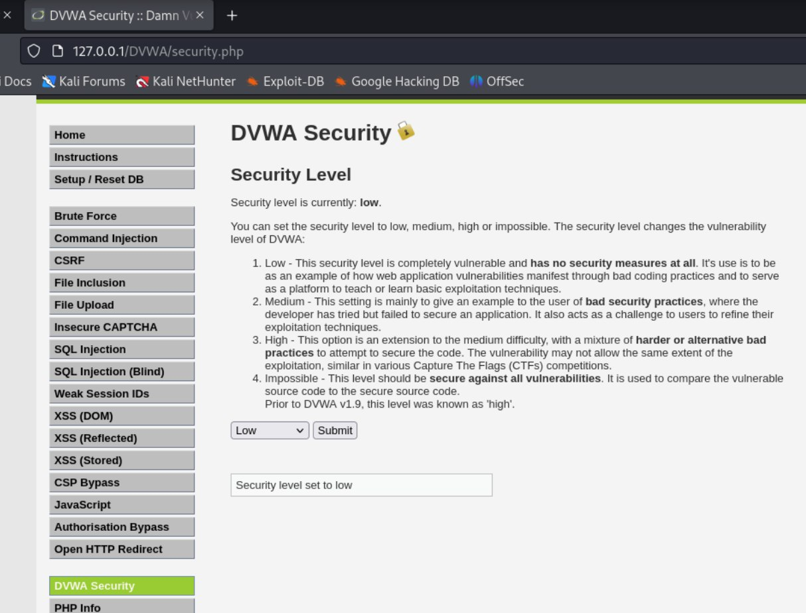
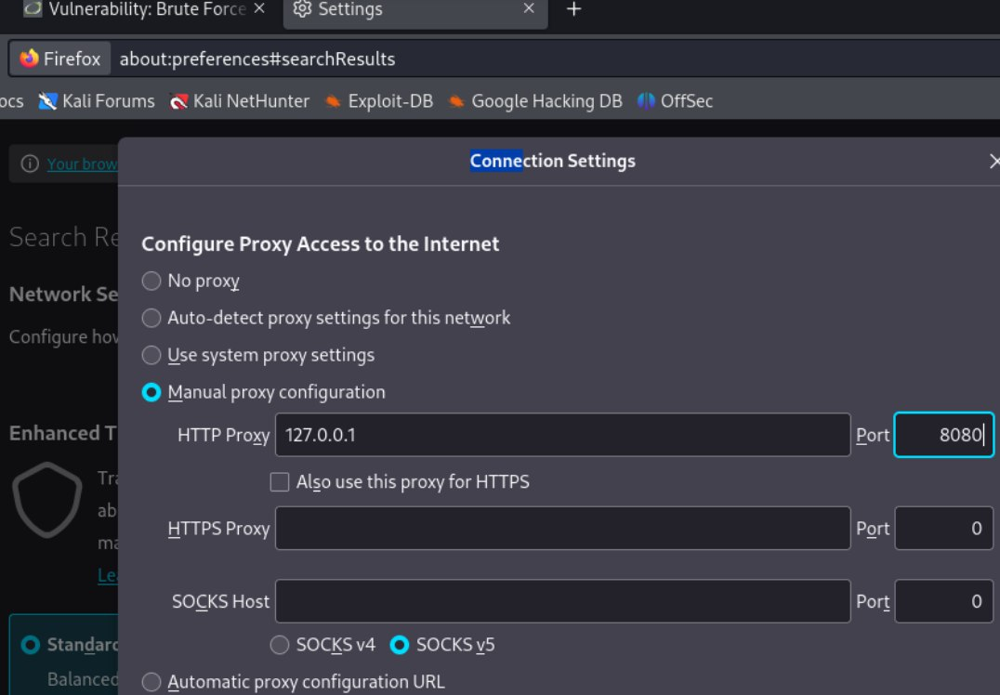
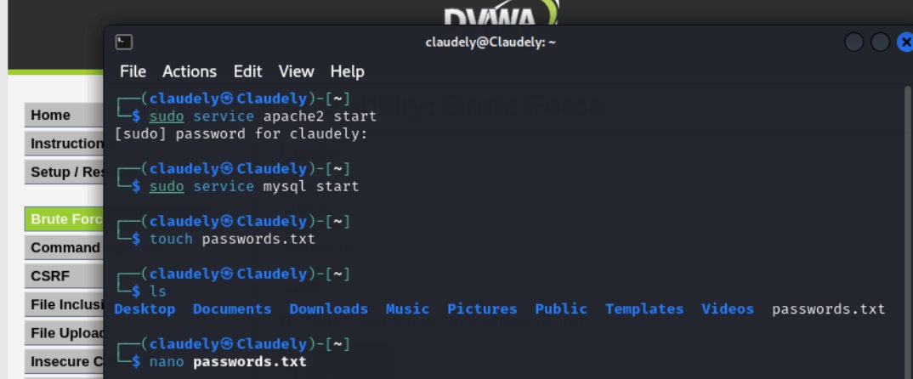
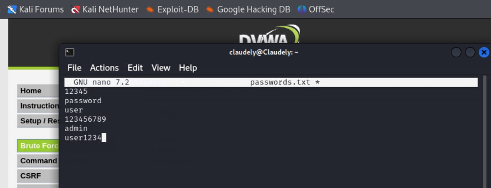
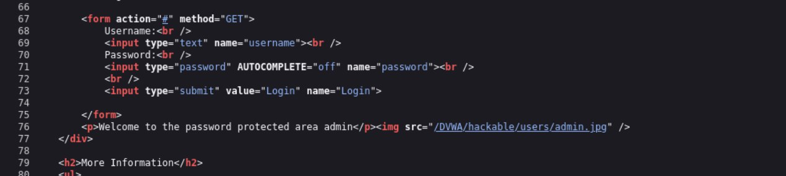
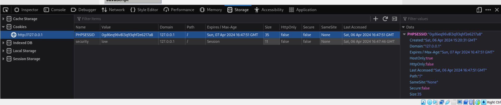
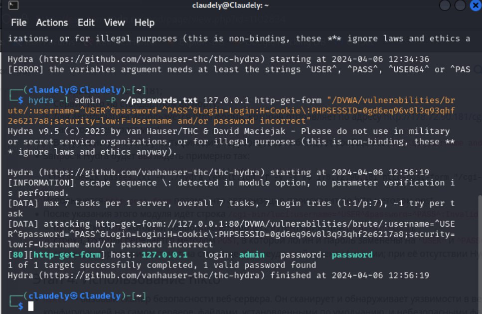
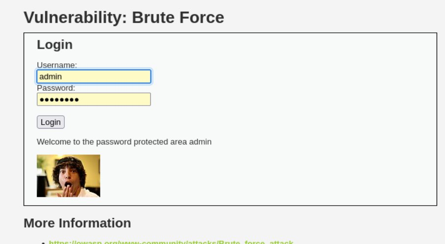

---
## Front matter
title: "Отчёт по индивидуальному проекту. Этап 3" 
subtitle: "Дисциплина: Основы информационной безопасности"
author: "Бансимба Клодели Дьегра НПИбд-02-22 "

## Generic otions
lang: ru-RU
toc-title: "Содержание"

## Bibliography
bibliography: bib/cite.bib
csl: pandoc/csl/gost-r-7-0-5-2008-numeric.csl

## Pdf output format
toc: true # Table of contents
toc-depth: 2
lof: true # List of figures
lot: true # List of tables
fontsize: 12pt
linestretch: 1.5
papersize: a4
documentclass: scrreprt
## I18n polyglossia
polyglossia-lang:
  name: russian
  options:
	- spelling=modern
	- babelshorthands=true
polyglossia-otherlangs:
  name: english
## I18n babel
babel-lang: russian
babel-otherlangs: english
## Fonts
mainfont: PT Serif
romanfont: PT Serif
sansfont: PT Sans
monofont: PT Mono
mainfontoptions: Ligatures=TeX
romanfontoptions: Ligatures=TeX
sansfontoptions: Ligatures=TeX,Scale=MatchLowercase
monofontoptions: Scale=MatchLowercase,Scale=0.9
## Biblatex
biblatex: true
biblio-style: "gost-numeric"
biblatexoptions:
  - parentracker=true
  - backend=biber
  - hyperref=auto
  - language=auto
  - autolang=other*
  - citestyle=gost-numeric
## Pandoc-crossref LaTeX customization
figureTitle: "Рис."
tableTitle: "Таблица"
listingTitle: "Листинг"
lofTitle: "Список иллюстраций"
lotTitle: "Список таблиц"
lolTitle: "Листинги"
## Misc options
indent: true
header-includes:
  - \usepackage{indentfirst}
  - \usepackage{float} # keep figures where there are in the text
  - \floatplacement{figure}{H} # keep figures where there are in the text
---

# Цель работы
Научиться использовать Hydra для нахождения паролей для авторизации.

# Выполнение лабораторной работы

Запустим DVWA.Перейдём в раздел DVWA Security и установим уровень защиты на “Low”. (рис. [-@fig:001])

{#fig:001 width=70%}

 В настройках браузера меняем вручную настройки конфигурации, указываем IP (рис. [-@fig:002])
 
 {#fig:002 width=70%}
 
 Создадим файл passwords.txt, в котором укажем пароли для подстановки (рис. [-@fig:003]).

{#fig:003 width=70%}

Запишем варианты паролей в нём (рис. [-@fig:004]).

{#fig:004 width=70%}

Откроем код веб-страницы и посмотрим метод отправки формы (рис. [-@fig:005]).

{#fig:005 width=70%}

Видим, что используется метод “GET”.

Теперь откроем Инспектор, перейдём в раздел Storage и скопируем значение PHPSESSID (рис. [-@fig:006])..

{#fig:006 width=70%}

Перейдём в консоль и воспользуемся Hydra – вставим полученное значение PHPSESSID в один из аргументов команды (рис. [-@fig:007]).

{#fig:007 width=70%}

По выполнении команды мы видим подходящие значения для авторизации. Введём их и успешно авторизуемся (рис. [-@fig:008]).

{#fig:008 width=70%} 

# Выводы

В ходе этапа проекта мы узнали как использовать hydra для подбора логина и пароля.

# Список литературы{.unnumbered}

1. Парасрам, Ш. Kali Linux: Тестирование на проникновение и безопасность : Для профессионалов. Kali Linux / Ш. Парасрам, А. Замм, Т. Хериянто, и др. – Санкт-Петербург : Питер, 2022. – 448 сс.
