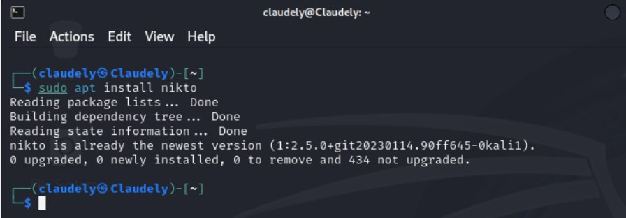
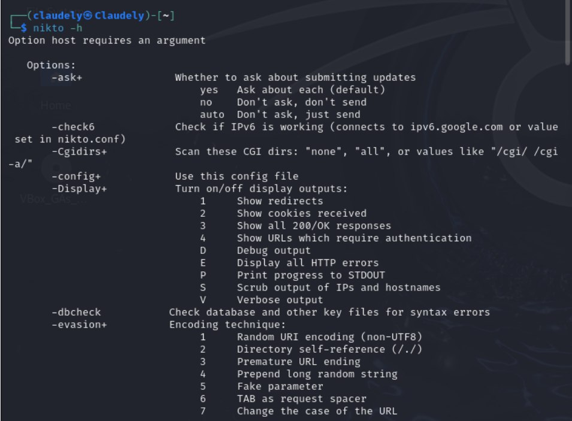
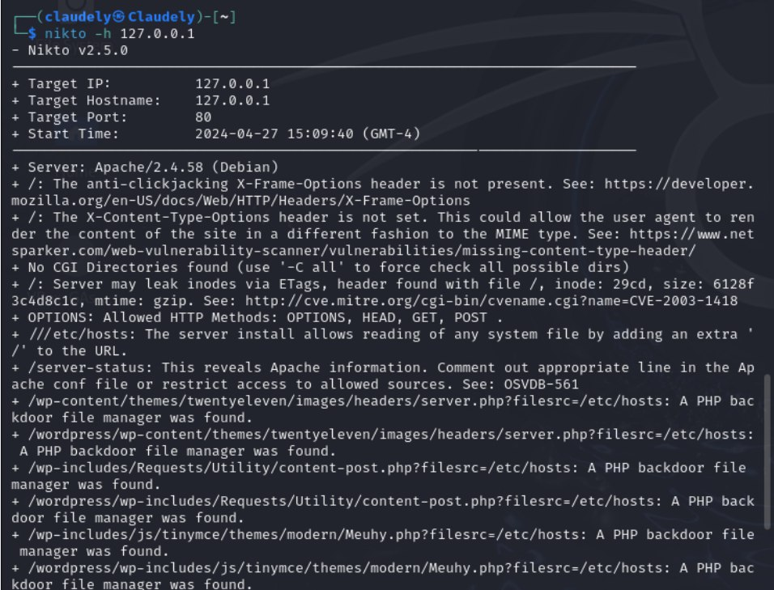
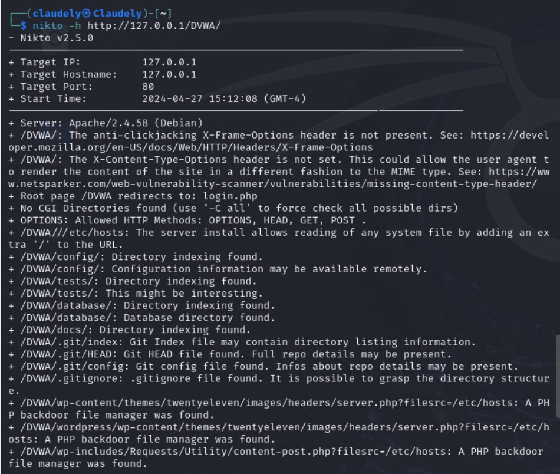

---
## Front matter
lang: ru-RU
title: Отчёт по индивидуальному проекту. Этап 4
author: |
	 Бансимба Клодели Дьегра  НПИбд-02-22\inst{1}

institute: |
	\inst{1}Российский Университет Дружбы Народов

date: 27 апреля, Москва, Россия

## Formatting
mainfont: PT Serif
romanfont: PT Serif
sansfont: PT Sans
monofont: PT Mono
toc: false
slide_level: 2
theme: metropolis
header-includes: 
 - \metroset{progressbar=frametitle,sectionpage=progressbar,numbering=fraction}
 - '\makeatletter'
 - '\beamer@ignorenonframefalse'
 - '\makeatother'
aspectratio: 169
section-titles: true

---
# Информация

:::::::::::::: {.columns align=center}
::: {.column width="70%"}

  * Бансимба Клодели Дьегра
  * Студент, НПИбд-02-22
  * Российский университет дружбы народов
  * [1032215651@pfur.ru](mailto: 1032215651@pfur.ru)

:::
::: {.column width="30%"}

:::
::::::::::::::

# Цели и задачи работы

## Цель лабораторной работы

Научиться использовать nikto (базовый сканер безопасности веб-сервера).

# Процесс выполнения лабораторной работы

## Запустим Nikto

Мы используем Kali Linux, то Nikto уже предустановлен, поэтому нам ничего скачивать и устанавливать не придется. Он будет расположен в категории «Анализ уязвимостей».

{#fig:001 width=70%}

## Nikto help

 Перед сканированием веб-серверов с помощью Nikto, давайте воспользуемся параметром -Help, чтобы увидеть все, что мы можем делать с этим инструментом. 
 
 {#fig:002 width=70%}

## Использование базовый синтаксис

для наших целей мы будем использовать базовый синтаксис <127.0.0.1 или http://127.0.0.1/DVWA/> с фактическим IP-адресом или именем хоста.
 
{#fig:003 width=70%}

## Использование базовый синтаксис

http://127.0.0.1/DVWA/ .

{#fig:004 width=70%}

# Выводы по проделанной работе
## Вывод

В ходе этапа проекта мы узнали как использовать nikto (базовый сканер безопасности веб-сервера).

## Список литературы{.unnumbered}

1. Парасрам, Ш. Kali Linux: Тестирование на проникновение и безопасность : Для профессионалов. Kali Linux / Ш. Парасрам, А. Замм, Т. Хериянто, и др. – Санкт-Петербург : Питер, 2022. – 448 сс.

