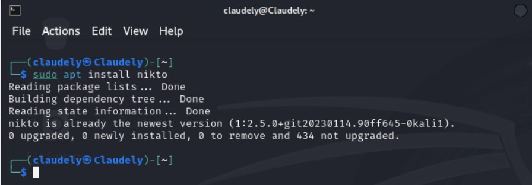
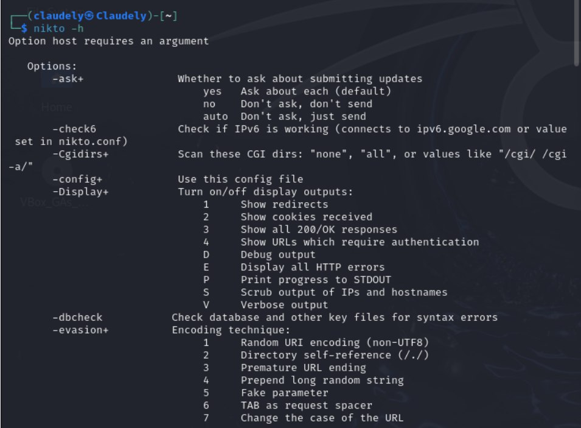
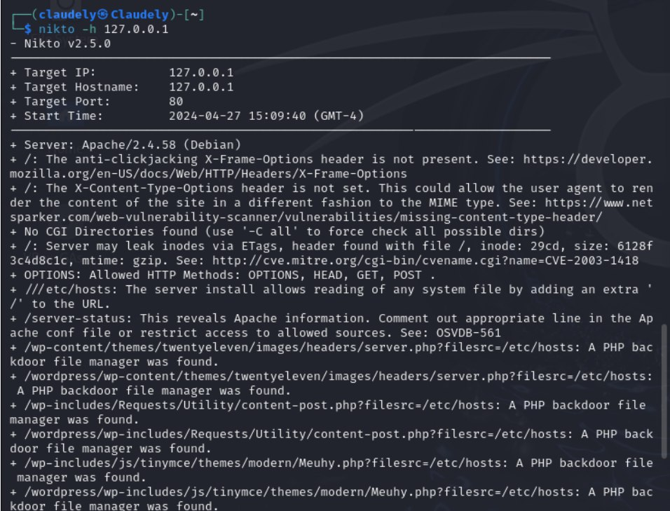
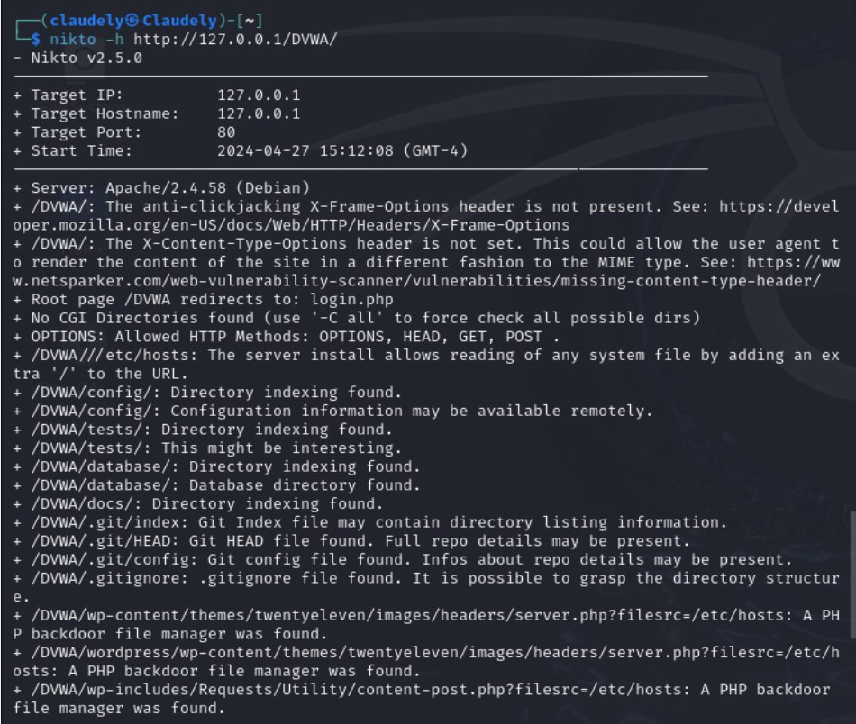

---
## Front matter
title: "Отчёт по индивидуальному проекту. Этап 4" 
subtitle: "Дисциплина: Основы информационной безопасности"
author: "Бансимба Клодели Дьегра НПИбд-02-22 "

## Generic otions
lang: ru-RU
toc-title: "Содержание"

## Bibliography
bibliography: bib/cite.bib
csl: pandoc/csl/gost-r-7-0-5-2008-numeric.csl

## Pdf output format
toc: true # Table of contents
toc-depth: 2
lof: true # List of figures
lot: true # List of tables
fontsize: 12pt
linestretch: 1.5
papersize: a4
documentclass: scrreprt
## I18n polyglossia
polyglossia-lang:
  name: russian
  options:
	- spelling=modern
	- babelshorthands=true
polyglossia-otherlangs:
  name: english
## I18n babel
babel-lang: russian
babel-otherlangs: english
## Fonts
mainfont: PT Serif
romanfont: PT Serif
sansfont: PT Sans
monofont: PT Mono
mainfontoptions: Ligatures=TeX
romanfontoptions: Ligatures=TeX
sansfontoptions: Ligatures=TeX,Scale=MatchLowercase
monofontoptions: Scale=MatchLowercase,Scale=0.9
## Biblatex
biblatex: true
biblio-style: "gost-numeric"
biblatexoptions:
  - parentracker=true
  - backend=biber
  - hyperref=auto
  - language=auto
  - autolang=other*
  - citestyle=gost-numeric
## Pandoc-crossref LaTeX customization
figureTitle: "Рис."
tableTitle: "Таблица"
listingTitle: "Листинг"
lofTitle: "Список иллюстраций"
lotTitle: "Список таблиц"
lolTitle: "Листинги"
## Misc options
indent: true
header-includes:
  - \usepackage{indentfirst}
  - \usepackage{float} # keep figures where there are in the text
  - \floatplacement{figure}{H} # keep figures where there are in the text
---

# Цель работы

Научиться использовать nikto (базовый сканер безопасности веб-сервера).

# Выполнение лабораторной работы

Мы используем Kali Linux, то Nikto будет предустановлен, поэтому нам ничего скачивать и устанавливать не придется. Он будет расположен в категории «Анализ уязвимостей». (рис. [-@fig:001])

{#fig:001 width=70%}

 Перед сканированием веб-серверов с помощью Nikto, давайте воспользуемся параметром -Help, чтобы увидеть все, что мы можем делать с этим инструментом. (рис. [-@fig:002])
 
 {#fig:002 width=70%}
 
 Как вы видите из предыдущего шага, у Nikto есть много вариантов использования, но для наших целей мы будем использовать базовый синтаксис <127.0.0.1 или http://127.0.0.1/DVWA/> с фактическим IP-адресом или именем хоста без угловых скобок." (рис. [-@fig:003]).

{#fig:003 width=70%}

http://127.0.0.1/DVWA/ (рис. [-@fig:004]).

{#fig:004 width=70%}

# Выводы

В ходе этапа проекта мы узнали как использовать nikto (базовый сканер безопасности веб-сервера).

# Список литературы{.unnumbered}

1. Парасрам, Ш. Kali Linux: Тестирование на проникновение и безопасность : Для профессионалов. Kali Linux / Ш. Парасрам, А. Замм, Т. Хериянто, и др. – Санкт-Петербург : Питер, 2022. – 448 сс.
